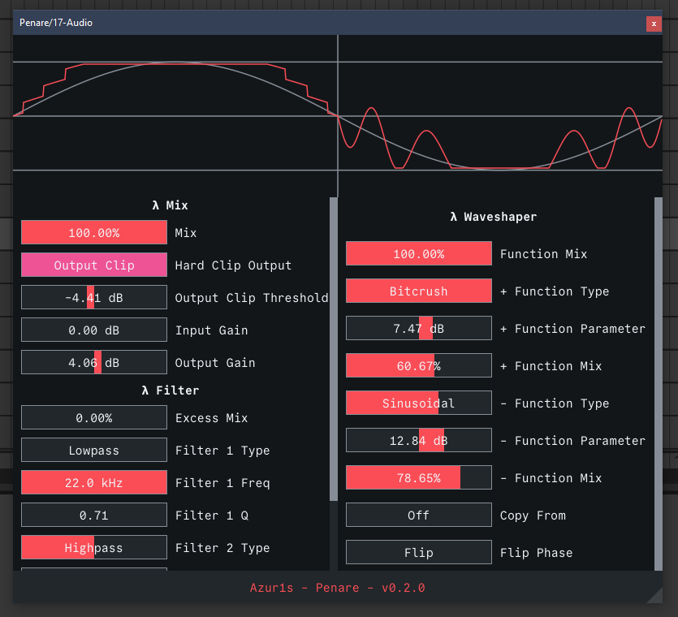

# Penare

A wonky distortion plugin :3



## Installing
For Windows:
1. Get the lastest release from the [here](https://github.com/azur1s/penare/releases)
2. Unzip and find the `.vst3` or `.clap` file inside and move it to your VST3/CLAP directory

For MacOS:
1. Do the same as Windows
2. If MacOS thinks that I'm a evil virus programmer 😈 and you don't believe I am 😇 then you can run this command in terminal:
    ```shell
    # Replace `PATH_TO_PLUGIN` to where your plugin is
    xattr -cr PATH_TO_PLUGIN
    ```
    Otherwise, if you don't trust me, then don't do it

## Features
- Pre and Post gain control (no way)
- Filter control (like which range the distortion is applied) and you can mix it back afterward :O
- Symmetric and Asymmetric waveshaping!
- Rectifier
  - Half and Full rectify
  - Mix between dry and wet signal
  - Mix in wet signal (in case you want to layer it)
- Crusher
  - Adjustable step (you can use this for quality reduction kind-of deal)
  - Mix between or in dry and wet signal

## Contributing
Some of the algorithms probably is not correct so you can fix it if you think it's incorrect. Or you can add new one if you're feeling generous :D

## Building

The [`debug.ps1`](debug.ps1) is for me to use. Although you can use it, if it works.

Use this to compile to VST3 and CLAP.

```shell
# Debug build, huge file size
cargo xtask bundle penare
# Release build, small file size
cargo xtask bundle penare --release
```
